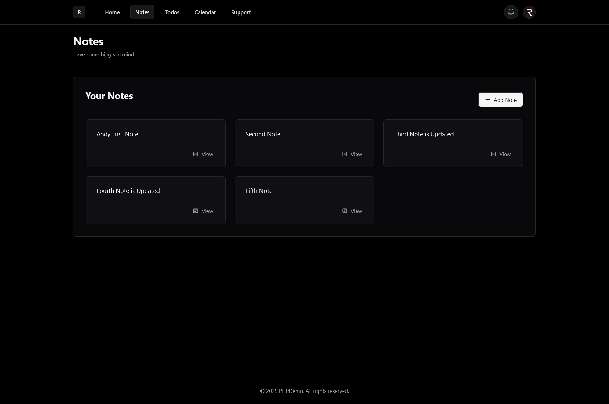

# PHP Demo Course w/ Laracasts

This repository contains code and exercises from the [PHP For Beginners 2023 Edition](https://laracasts.com/series/php-for-beginners-2023-edition) course on Laracasts. It is a hands-on learning project covering modern PHP fundamentals, including routing, controllers, authentication, validation, and more.

## Table of Contents

- [About](#about)
- [Features](#features)
- [Project Structure](#project-structure)
- [Installation](#installation)
- [Usage](#usage)
- [Screenshots](#screenshots)
- [Contributing](#contributing)
- [License](#license)
- [Credits](#credits)

## About

This project is a learning playground for PHP beginners, following the Laracasts course. It demonstrates how to build a simple PHP application from scratch, without frameworks, to understand the core concepts of PHP web development.

## Features

- Custom routing system
- MVC-like structure
- User authentication (login, registration, session)
- Notes CRUD
- Form validation
- Middleware for route protection
- Error handling and custom error pages

## Project Structure

```
laracasts-learn-php/
├── Core/           # Core classes (Router, Database, Auth, etc.)
├── Http/           # Controllers and Forms
├── database/       # Database schema and SQL files
├── public/         # Public assets and entry point (index.php)
├── views/          # PHP view templates
├── routes.php      # Application routes
├── config.php      # Configuration settings
├── bootstrap.php   # App bootstrapper
└── README.md
```

## Installation

1. **Clone the repository:**
   ```bash
   git clone https://github.com/Raka023/laracasts-learn-php.git
   cd laracasts-learn-php
   ```

2. **Set up your web server:**
   - Point your web server’s document root to the `public/` directory.
   - Make sure PHP (8.0+) is installed.

3. **Configure the database:**
   - Create a new MySQL database.
   - Import the schema from `database/database.sql`.
   - Update your database credentials in `config.php`.

4. **Start the development server (optional):**
   ```bash
   php -S localhost:8000 -t public
   ```

5. **Visit the app:**
   - Open [http://localhost:8000](http://localhost:8000) in your browser.

## Usage

- Register a new user or log in.
- Create, edit, and delete notes and todos.
- Try logging out and logging in to see authentication in action.

## Screenshots



## Contributing

Contributions are welcome! Feel free to fork the repository and submit a pull request.

## License

This project is for educational purposes and does not have a specific license.

## Credits

- [Laracasts - PHP For Beginners 2023 Edition](https://laracasts.com/series/php-for-beginners-2023-edition)
- Inspired by Jeffrey Way’s teaching style

<sub>*In this project most of the UI Design are made AI*</sub>